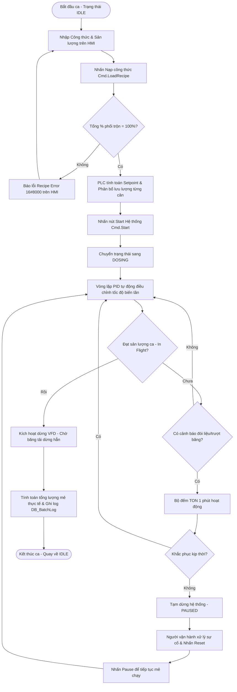
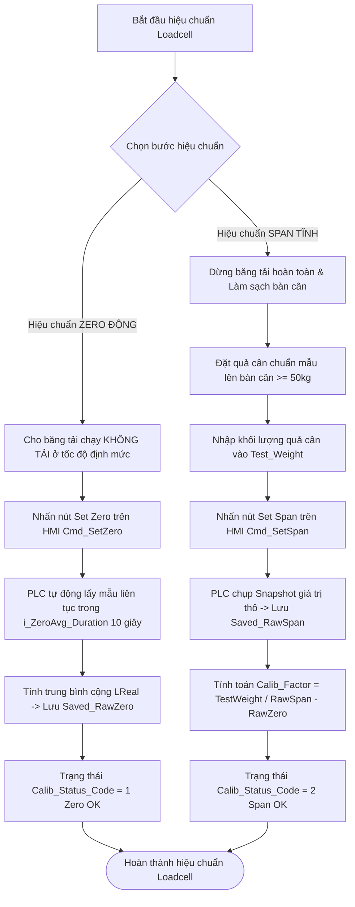

# TÀI LIỆU HƯỚNG DẪN VẬN HÀNH & BẢO TRÌ (O&M MANUAL)
## HỆ THỐNG CÂN ĐỊNH LƯỢNG LIÊN TỤC 7 BĂNG TẢI (WEIGHING FEEDER SYSTEM)
### ỨNG DỤNG TRONG NHÀ MÁY XI MĂNG

---

## 1. TỔNG QUAN HỆ THỐNG (SYSTEM OVERVIEW)

### 1.1. Nguyên lý Hoạt động Chung
Hệ thống cân định lượng liên tục (Weighing Feeder System) bao gồm 7 băng tải độc lập, thực hiện nhiệm vụ cấp liệu phối trộn liên tục cho dây chuyền sản xuất trong nhà máy xi măng. Bảy nguyên liệu tương ứng với 7 phễu cân bao gồm:
1. **Phễu cân 1**: Quặng sắt (Iron Ore)
2. **Phễu cân 2**: Than (Coal)
3. **Phễu cân 3**: Đá (Stone)
4. **Phễu cân 4**: Vôi (Lime)
5. **Phễu cân 5**: Cát (Sand)
6. **Phễu cân 6**: Sỏi (Gravel)
7. **Phễu cân 7**: Phụ gia (Additive)

Toàn bộ hệ thống được điều khiển tự động thông qua bộ lập trình PLC Siemens S7-1500 (hoặc tương thích), lập trình chủ yếu bằng ngôn ngữ **SCL (Structured Control Language)** trên nền tảng **TIA Portal**. 

Hệ thống hoạt động dựa trên vòng quét ngắt chu kỳ cố định 100ms (**Cyclic Interrupt OB30** - gọi block [CyclicInterrupt.scl](file:///d:/GoogleDrive/Backup/unified_code/Program%20blocks/CyclicInterrupt.scl)), đảm bảo tính toán thời gian thực cho các thuật toán tích lũy khối lượng và điều khiển hồi tiếp PID.

#### Quy trình Khởi động Hệ thống khi Bật nguồn (Startup Logic):
Khi PLC chuyển từ chế độ STOP sang RUN hoặc khi vừa cấp nguồn, khối chức năng khởi động [Startup.scl](file:///d:/GoogleDrive/Backup/unified_code/Program%20blocks/Startup.scl) (OB100) sẽ tự động thực hiện các tác vụ an toàn sau:
1. Đưa trạng thái hệ thống về chế độ chờ: Gán trạng thái hệ thống `DB_HMI_Data.System_Status.System_State := 0` (IDLE).
2. Xóa toàn bộ lệnh điều khiển dính latch từ HMI nhằm đảm bảo an toàn, ngăn việc thiết bị tự khởi động lại đột ngột:
   * `DB_HMI_Data.Commands.Start := FALSE`
   * `DB_HMI_Data.Commands.Stop := FALSE`
   * `DB_HMI_Data.Commands.Reset := FALSE`
   * `DB_HMI_Data.Commands.LoadRecipe := FALSE`
3. Xóa các cờ lỗi chốt cũ: Đưa `System_Error` về `FALSE` và `Error_ID` về `0`. Nếu các sự cố phần cứng thực tế vẫn tồn tại, hệ thống sẽ tự động kích hoạt lại lỗi ngay khi bắt đầu vòng quét chính thông qua OB82/OB86.
4. Đảm bảo an toàn ngõ ra phần cứng: Toàn bộ ngõ ra VFD Start và VFD Speed của 7 cân được reset về trạng thái dừng hoàn toàn trước khi bắt đầu chu kỳ quét đầu tiên.

#### Cơ chế Liên kết Thiết bị vật lý và HMI (Input/Output Mapping):
Khối chương trình [Main.scl](file:///d:/GoogleDrive/Backup/unified_code/Program%20blocks/Main.scl) (OB1) thực hiện nhiệm vụ ánh xạ dữ liệu vật lý (I/O Mapping) giữa phần cứng và phần mềm điều khiển:
* **Tín hiệu ngõ vào (Input Mapping)**: Đọc trạng thái công tắc Local/Remote tại hiện trường (`DI_Feeder_XX_Local`), tín hiệu báo lỗi biến tần (`DI_Feeder_XX_Fault`), tín hiệu cảm biến Loadcell (`AI_Feeder_XX_Weight`), và tần số/xung của bộ đếm tốc độ cao Encoder (`HSC_Feeder_XX_Hz`). Các dữ liệu này được gán đồng bộ vào DB trung gian `DB_IO_Mapping.Input`.
* **Tín hiệu ngõ ra (Output Mapping)**: Xuất lệnh khởi động biến tần (`DO_Feeder_XX_Start`) và giá trị tốc độ Analog (`AQ_Feeder_XX_Speed` từ 0 - 27648) tương ứng với giá trị điều khiển trong `DB_IO_Mapping.Output`.
* **Cơ chế khóa an toàn tại chỗ (Local Interlock)**: 
  * Khi công tắc tại hiện trường gạt sang **LOCAL** (`DI_Feeder_XX_Local = TRUE`), PLC sẽ lập tức khóa ngõ ra vật lý: Đưa lệnh chạy VFD về `FALSE` và tốc độ ngõ ra analog về `0` nhằm ưu tiên quyền điều khiển hoàn toàn tại chỗ cho kỹ thuật viên bảo trì. PLC vẫn tiếp tục đọc dữ liệu Loadcell và tốc độ Encoder để phục vụ giám sát.
  * Nếu hệ thống đang trong mẻ chạy tự động hữu hạn, việc gạt công tắc sang Local sẽ kích hoạt lỗi liên khóa hệ thống (`temp_Fault_LocalInBatch`), tạm dừng toàn bộ mẻ để tránh sai lệch tỷ lệ phối trộn. Đối với mẻ vô hạn (`Infinite_Batch = TRUE`), gạt Local chỉ dừng độc lập băng tải đó mà không dừng toàn bộ hệ thống.
* **Cờ Nhịp tim (PLC Life Bit)**: Tag `DB_HMI_Data.System_Status.PLC_Life_Bit` đảo trạng thái liên tục theo mỗi vòng quét của OB1. Nếu giao diện HMI phát hiện bit này đứng im không đổi trạng thái trong quá trình chạy quá 2 giây, HMI sẽ cảnh báo mất kết nối truyền thông.
* **Đo độ trễ mạng (Ping Echo)**: PLC tự động phản hồi tín hiệu Ping từ HMI thông qua việc gán `PLC_Ping_Response := HMI_Ping_Request`. Tín hiệu này giúp hệ thống đo lường độ trễ truyền thông thực tế `Latency_ms`.

---

### 1.2. Các Thành phần Phần mềm Chính
Kiến trúc chương trình được thiết kế theo tiêu chuẩn hướng đối tượng ISA-88, phân chia thành các cấp giám sát và điều khiển rõ ràng:

#### cấp Giám sát Hệ thống (Unit Supervision):
* **`DB_BatchManager`**: Điều phối hoạt động chung của toàn bộ 7 phễu cân, tính toán setpoint lưu lượng động cho từng phễu, kiểm tra điều kiện an toàn, giám sát lỗi tổng hợp và quản lý dữ liệu ca sản xuất.
* **`FB_BatchStateMachine`**: Khối chức năng máy trạng thái ISA-88 thực thi quy trình vận hành mẻ sản xuất với 4 trạng thái chính:
  * `0 (IDLE)`: Trạng thái chờ, sẵn sàng nạp công thức và chạy.
  * `30 (DOSING)`: Trạng thái đang cấp liệu liên tục, vòng lặp PID hoạt động tự động.
  * `90 (FAULT)`: Trạng thái dừng khẩn cấp do sự cố phần cứng hoặc an toàn nghiêm trọng.
  * `99 (PAUSED)`: Trạng thái tạm dừng mẻ (do người vận hành hoặc do tự động bù đắp/chờ khắc phục sự cố nhẹ).

#### cấp Mô-đun Thiết bị (Equipment Modules - EM):
* **`FB_WeighFeeder`**: Mô-đun thiết bị thông minh đại diện cho một băng tải cân định lượng. Khối này bao gói và điều phối toàn bộ các khối chức năng điều khiển con (Control Modules) thuộc phễu cân đó.

#### cấp Mô-đun Điều khiển (Control Modules - CM):
* **`FB_AnalogInput_Filter`**: Khối xử lý tín hiệu analog thô từ Loadcell, hỗ trợ 2 chế độ lọc nhiễu cơ khí và nhiễu điện từ.
* **`FB_Calib_Loadcell`**: Khối thực hiện thuật toán hiệu chuẩn tĩnh (Span) và hiệu chuẩn động (Zero) để tính toán chính xác khối lượng vật liệu trên bàn cân.
* **`FB_Encoder_SpeedCalc`**: Tính toán tốc độ vòng quay rulo (RPM) và tốc độ dài băng tải (m/s) từ bộ đếm xung tốc độ cao Encoder.
* **`FB_Feeder_Totalizer`**: Bộ cộng dồn tích lũy khối lượng vật liệu, điều khiển giảm tốc cuối mẻ (Dribble) và cắt sớm bù vật liệu rơi tự do (In-Flight Compensation).
* **`FB_Feeder_PID`**: Khối chức năng đóng gói Technology Object `PID_Compact` của Siemens để tự động điều chỉnh tốc độ biến tần dựa trên phản hồi lưu lượng thực tế.
* **`FB_VFD_Driver`**: Khối điều khiển chạy/dừng biến tần theo cơ chế tự giữ an toàn, lọc tín hiệu lỗi biến tần và scale tốc độ analog ngõ ra.
* **`FB_Feeder_Alarms`**: Quản lý các cảnh báo động của băng tải bao gồm lệch lưu lượng cao/thấp và cảnh báo hết liệu (Starvation).
* **`FB_MechCalib`**: Khối thực hiện hiệu chuẩn cơ khí cho đường kính rulo và chiều dài đoạn cân.
* **`FB_Feeder_Sim`**: Khối chức năng mô phỏng động học vật lý (tải trọng, tốc độ, nhiễu tín hiệu) hỗ trợ chạy thử nghiệm không cần phần cứng.

---

## 2. GIAO DIỆN VÀ CẤU TRÚC DỮ LIỆU (DATA STRUCTURE & INTERFACES)

### 2.1. Ý nghĩa các Khối Dữ liệu Cấu hình
Hệ thống sử dụng các Kiểu Dữ liệu Người dùng định nghĩa (UDT) để đồng bộ hóa và tối ưu hóa cấu trúc dữ liệu truyền thông với HMI:

#### UDT_Feeder_Config (Cấu hình Thiết bị & Vòng lặp PID):
Khối cấu hình chứa các hằng số vật lý và thông số vận hành cơ bản cho từng cân:
* `MaxFlowRate` (Real): Công suất định mức tối đa của phễu cân (kg/h).
* `WeighSpan` (Real): Chiều dài hiệu dụng của đoạn cân (m).
* `WheelDiameter` (Real): Đường kính rulo băng tải (mm).
* `PulsePerRev` (Int): Số xung trên một vòng quay của Encoder (PPR).
* `LoadcellCapacity` (Real): Tải trọng giới hạn tối đa của cảm biến lực Loadcell (kg).
* `DevAlarm_Pct` (Real - Mặc định: 15%): Ngưỡng sai lệch lưu lượng cho phép trước khi báo cảnh báo.
* `DevAlarm_Delay_sec` (Real - Mặc định: 5.0s): Thời gian trễ lọc tín hiệu sai lệch lưu lượng.
* `InFlight_kg` (Real - Mặc định: 0.5kg): Khối lượng vật liệu rơi tự do (khoảng cách từ băng tải đến phễu nhận) cần bù trừ khi dừng mẻ.
* `Dribble_Pct` (Real - Mặc định: 10%): Phần trăm khối lượng còn lại so với mục tiêu để hệ thống chuyển sang chế độ chạy chậm nhỏ giọt.
* `Dribble_Speed_Pct` (Real - Mặc định: 25%): Tốc độ định lượng nhỏ giọt (% so với tốc độ chuẩn của mẻ).
* *Các tham số PID*: `PID_Kp` (Hệ số Kp), `PID_Ti` (Thời gian tích phân Ti), `PID_Td` (Thời gian đạo hàm Td), `PID_OutputMin` (0.0%), `PID_OutputMax` (100.0%), `PID_Deadband` (Vùng chết PID).

#### UDT_Feeder_Cmd (Lệnh Điều khiển từ HMI / State Machine):
* `AutoMode` (Bool): Chọn chế độ hoạt động (TRUE = Tự động PID, FALSE = Chạy tay bằng biến trở HMI).
* `Start` / `Stop` / `Reset` (Bool): Các lệnh chạy, dừng, và reset lỗi dạng xung.
* `Setpoint_Flow` (Real): Setpoint năng suất đặt cho băng tải (kg/h).
* `Target_Weight` (Real): Khối lượng đích cần định lượng cho mẻ chạy (kg).
* `Infinite_Batch` (Bool): Kích hoạt chế độ chạy liên tục vô hạn, không dừng theo khối lượng tích lũy.
* `ManualSpeed_HMI` (Real): Tốc độ chạy tay nhập trực tiếp từ giao diện (0 - 100%).
* `Clear_Totalizer` (Bool): Lệnh xóa khối lượng tích lũy về 0 để chuẩn bị mẻ mới.

#### UDT_Feeder_Status (Thông tin Phản hồi Thời gian thực):
* `Running` / `Done` / `Dribble_Active` (Bool): Trạng thái hoạt động thực tế.
* `Fault` (Bool): Cờ báo lỗi chung (dừng thiết bị).
* `Fault_VFD` / `Fault_Overload` / `Fault_Sensor` / `Fault_Encoder` (Bool): Các cờ báo lỗi chi tiết.
* `Alarm_DevHigh` / `Alarm_DevLow` (Bool): Cảnh báo sai lệch lưu lượng cao/thấp.
* `Alarm_Empty` (Bool): Cảnh báo đói liệu (hết nguyên liệu trong phễu chứa).
* `Actual_FlowRate` (Real): Lưu lượng thực tế thời gian thực (kg/h).
* `Totalized_Weight` (Real): Tổng khối lượng vật liệu đã cân được trong mẻ hiện tại (kg).
* `Belt_Speed` (Real): Tốc độ dài thực tế của dây băng (m/s).
* `Load_Density` (Real): Mật độ vật liệu tức thời trên bàn cân (kg/m).
* `Speed_Pct` (Real): Tốc độ ngõ ra thực tế gửi xuống VFD (0 - 100%).
* `Calib_Status_Code` (Int): Mã trạng thái hiệu chuẩn (0 = Idle, 1 = Zero OK, 2 = Span OK, 3 = Zeroing, 9 = Error).
* `Feeder_State_Code` (Int): Mã trạng thái tổng hợp đồng bộ HMI (0 = Sẵn sàng, 1..5 = Nhóm lỗi, 6 = Tại chỗ, 7..9 = Nhóm cảnh báo, 10..13 = Đang hoạt động).

#### UDT_Recipe (Công thức Phối trộn):
* `BatchID` (WString[20]): Mã ca sản xuất hoặc đợt phối trộn.
* `Target_Production` (Real): Tổng sản lượng mục tiêu của cả ca sản xuất (kg). Nếu $\le 0.001$ kg, hệ thống tự động thiết lập chạy vô hạn.
* `Material_Names` (Array[1..7] of WString): Tên hiển thị của 7 loại nguyên liệu.
* `Material_Percents` (Array[1..7] of Real): Tỷ lệ phần trăm khối lượng mong muốn của từng nguyên liệu.
* `Target_FlowRate` (Real): Năng suất tổng mong muốn của toàn hệ thống (kg/h).

---

### 2.2. Các Thông số Operator Cần Đặc biệt Lưu ý khi Cài đặt
Để vận hành hệ thống an toàn và chính xác, người vận hành (Operator) bắt buộc phải kiểm tra kỹ các thông số sau trên giao diện HMI trước khi phát lệnh chạy:

1. **Tổng Phần trăm Công thức phối trộn (`Material_Percents`)**:
   > [!IMPORTANT]
   > Tổng tỷ lệ phần trăm khối lượng phối trộn của cả 7 loại nguyên liệu bắt buộc phải bằng **chính xác 100.0%** (Sai số cho phép trong khoảng cực nhỏ: **99.9% đến 100.1%**). 
   > 
   > Nếu tổng phần trăm nằm ngoài dải này, khi nhấn nút nạp công thức, máy trạng thái `FB_BatchStateMachine` sẽ lập tức báo lỗi công thức (gán cờ lỗi `stat_Recipe_Error := TRUE` và đặt mã lỗi hệ thống `o_Error_ID := 16#8000`), đồng thời từ chối lệnh khởi động hệ thống.
2. **Sản lượng Ca mục tiêu (`Target_Production`)**:
   * Nếu muốn chạy theo mẻ hữu hạn (ví dụ: trộn đúng 50 tấn liệu rồi dừng): Nhập khối lượng mong muốn (kg) vào ô sản lượng.
   * Nếu muốn hệ thống chạy liên tục không dừng (chờ lệnh dừng thủ công): Nhập giá trị **0.0** (PLC sẽ tự động kích hoạt cờ chạy vô hạn `Infinite_Batch := TRUE` xuống toàn bộ các cân).
3. **Năng suất Tổng Yêu cầu (`Target_FlowRate`)**:
   * Đây là công suất tổng mong muốn của toàn dây chuyền (kg/h). PLC sẽ tự động phân bổ setpoint lưu lượng cho từng cân dựa trên tỷ lệ % phối trộn của cân đó.
   * PLC sở hữu cơ chế bảo vệ thông minh: Tự động tính toán năng suất tổng tối đa có thể đáp ứng dựa trên giới hạn vật lý `MaxFlowRate` của từng cân tham gia phối trộn:
     $$\text{temp\_TotalFlow\_Max} = \min_{i} \left( \frac{\text{MaxFlowRate}[i]}{\text{Percent}[i] / 100} \right)$$
     Nếu Operator nhập `Target_FlowRate` vượt quá giới hạn an toàn này, PLC sẽ tự động "cắt gọt" (Cap) năng suất tổng về bằng đúng giá trị giới hạn tối đa `temp_TotalFlow_Max` để bảo vệ động cơ và tránh tràn liệu cơ học.
4. **Giới hạn Thông số PID Compact**:
   * Đảm bảo các tham số PID nhập từ trang cấu hình của từng cân không bị bằng 0 vô lý: Hệ số tỷ lệ `PID_Kp` phải $> 0.001$ và thời gian tích phân `PID_Ti` phải $> 0.0$.
   * PLC đã tích hợp khối kiểm tra tự động `VALIDATE_CONFIGS` trong chương trình quét chính. Nếu phát hiện các tham số này bằng 0 hoặc âm, PLC sẽ tự động ghi đè giá trị an toàn mặc định (`PID_Kp := 1.0` và `PID_Ti := 10.0`) để tránh gây treo hoặc dừng đột ngột bộ điều khiển `PID_Compact` của Siemens.

---

## 3. HƯỚNG DẪN VẬN HÀNH (OPERATING PROCEDURES)

### 3.1. Quy trình Khởi động Hệ thống và Nạp Công thức (Recipe)
Quy trình nạp công thức và khởi động dây chuyền sản xuất được thực hiện theo các bước chuẩn hóa sau:

1. **Chuẩn bị và Kiểm tra Interlock**:
   * Kiểm tra giao diện HMI để đảm bảo trạng thái hệ thống hiện tại đang ở **SẴN SÀNG (IDLE)** (tag `DB_HMI_Data.System_Status.System_State = 0`).
   * Đảm bảo không còn bất kỳ cờ báo lỗi phần cứng (`Hardware_Error = FALSE`) hay lỗi hệ thống nào đang chốt. Nếu có lỗi, thực hiện nhấn nút **Reset** trên HMI (tag `Commands.Reset := TRUE`) để giải trừ lỗi.
2. **Thiết lập Công thức (Recipe Preview)**:
   * Trên màn hình cài đặt công thức HMI, người vận hành nhập các thông số:
     * Mã số mẻ chạy (`Recipe_Preview.Current_Recipe.BatchID`).
     * Sản lượng ca mục tiêu (`Recipe_Preview.Current_Recipe.Target_Production` - đơn vị: kg).
     * Năng suất tổng yêu cầu (`Recipe_Preview.Current_Recipe.Target_FlowRate` - đơn vị: kg/h).
     * Nhập tỷ lệ phần trăm mong muốn cho 7 nguyên liệu tại mảng `Recipe_Preview.Current_Recipe.Material_Percents[1..7]`.
3. **Thực hiện Nạp Công thức (Load Recipe)**:
   * Nhấn nút **Nạp công thức** trên màn hình HMI (tag `DB_HMI_Data.Commands.LoadRecipe := TRUE`).
   * Khối máy trạng thái `FB_BatchStateMachine` sẽ thực hiện kiểm tra công thức:
     * Cộng dồn phần trăm: `temp_TotalPercent := 0.0` sau đó cộng dồn cả 7 nguyên liệu.
     * Nếu hợp lệ ($99.9\% \le \text{temp\_TotalPercent} \le 100.1\%$): PLC sao chép toàn bộ dữ liệu công thức xem trước vào công thức hoạt động chính thức `Recipe.Current_Recipe` và chốt mảng tỷ lệ phối trộn vào biến tĩnh `stat_Active_Percents`.
     * PLC tự động tính toán năng suất giới hạn an toàn tối đa cho phép của hệ thống, tự động gán setpoint lưu lượng (`Setpoint_Flow[i]`) và sản lượng mục tiêu (`Target_Weight[i]`) cho từng cân theo đúng tỷ lệ phần trăm đã chốt.
     * PLC tính toán và hiển thị thời gian dự kiến hoàn thành mẻ chạy `MixTime_HMI` (phút) lên màn hình để Operator giám sát.
     * Phát lệnh xóa bộ cộng dồn khối lượng tích lũy của cả 7 cân (`Clear_Totalizer := TRUE`) để reset số liệu ca về 0, chuẩn bị cho mẻ sản xuất mới.
     * Nếu không hợp lệ: PLC từ chối nạp, bật cờ lỗi hệ thống và xuất mã lỗi `o_Error_ID := 16#8000` (Recipe Error).
4. **Phát lệnh Khởi động (Start System)**:
   * Sau khi nạp công thức thành công, nhấn nút **START** trên HMI (tag `DB_HMI_Data.Commands.Start := TRUE`).
   * Máy trạng thái chuyển đổi trạng thái sang **ĐANG CẤP LIỆU (DOSING)** (tag `System_State := 30`). PLC phát lệnh Start (`Start := TRUE`) đồng loạt xuống các băng tải có tham gia sản xuất (băng tải có tỷ lệ % phối trộn $> 0.0\%$).

---

### 3.2. Hướng dẫn Vận hành Hệ thống Cấp liệu
Quy trình vận hành phễu cân định lượng trong ca sản xuất được phối hợp nhịp nhàng giữa chế độ Tự động và chế độ chạy tay:

#### Chế độ Vận hành Tự động (Auto Mode):
* Để vận hành tự động toàn hệ thống, cờ chế độ tay toàn cục bắt buộc phải tắt (`Commands.Global_Manual_Mode := FALSE`).
* Tại mỗi phễu cân, khối điều khiển `FB_WeighFeeder` nhận lệnh chạy tự động từ State Machine (`AutoMode := TRUE`, `Start := TRUE`, `Running := TRUE`).
* Khối chức năng `FB_Feeder_PID` sẽ chuyển đổi chế độ của Technology Object `PID_Compact` sang **Chế độ tự động** (Mode 3).
* Thuật toán PID Compact thực hiện so sánh setpoint lưu lượng yêu cầu (`Setpoint_Flow`) và phản hồi lưu lượng thực tế đã qua bộ lọc (`Actual_FlowRate`), tự động tính toán và điều chỉnh giá trị ngõ ra tốc độ biến tần (`Speed_Pct` từ 0.0 - 100.0%) nhằm triệt tiêu sai lệch tĩnh một cách nhanh nhất.

#### Chế độ Vận hành Bằng tay (Manual Mode):
* Được kích hoạt khi bật chế độ tay toàn cục (`Global_Manual_Mode := TRUE`) hoặc kích hoạt chạy tay độc lập từng phễu cân từ màn hình Faceplate chi tiết của phễu cân đó (`i_Cmd.AutoMode := FALSE`).
* Khối `FB_Feeder_PID` lập tức đưa `PID_Compact` về **Chế độ tay** (Mode 4), gán biến cho phép điều khiển tay `ManualEnable := TRUE` và nhận giá trị tốc độ đặt tay trực tiếp từ HMI: `ManualValue := ManualSpeed_HMI` (0 - 100%).
* Lúc này, Operator hoàn toàn chủ động điều chỉnh tốc độ chạy của băng tải thông qua thanh trượt hoặc ô nhập số tốc độ trên HMI. Chế độ này thường dùng để chạy thông tắc phễu liệu, chạy thử thiết bị sau khi bảo trì hoặc chạy xả liệu tồn dư.

#### Cơ chế Chuyển đổi Không gây Sốc thiết bị (Bumpless Transfer):
Khi Operator thực hiện chuyển đổi chế độ vận hành từ Tự động (Auto) sang Bằng tay (Manual) hoặc ngược lại:
* PLC kích hoạt cờ xung chuyển đổi chế độ `o_Manual_Cmd_Clear[i] := TRUE` trong vòng quét đầu tiên.
* Xung này lập tức xóa sạch các lệnh chạy tay và tốc độ đặt tay cũ trên HMI (`Start := FALSE`, `Stop := FALSE`, `ManualSpeed_HMI := 0.0`), đồng thời đồng bộ hóa giá trị đặt tay HMI về bằng đúng tốc độ ngõ ra thực tế của PID trước đó.
* Cơ chế này giúp động cơ không bị thay đổi tốc độ đột ngột (giật cục), bảo vệ hệ thống cơ khí hộp số/khớp nối băng tải và tránh gây sụt áp dòng điện.

#### Chế độ Chạy thử Thiết bị (Test Mode):
* Dùng để chạy thử độc lập một phễu cân bất kỳ mà không làm ảnh hưởng đến tiến trình sản xuất chung của hệ thống.
* Chỉ được kích hoạt khi hệ thống đang dừng (State = 0, 99 hoặc 90). Kích hoạt bằng cách bật tag `Test_Mode := TRUE` trên Faceplate của phễu cân cần thử.
* Operator nhập khối lượng đích chạy thử vào tag `Test_Target_Weight` (kg). Nhấn **Start** để khởi động băng tải chạy tự động theo năng suất phân bổ từ công thức.
* Băng tải chạy thử sẽ tự động tích lũy khối lượng vào biến riêng `Test_Total_Weight` và tự động ngắt dừng biến tần khi đạt mốc sản lượng đặt thử nghiệm (`Test_Total_Weight >= Test_Target_Weight - InFlight_kg`). Số liệu chạy thử này hoàn toàn độc lập và **không cộng dồn** vào sản lượng ca sản xuất chính.

---

### 3.3. Quy trình Tính toán Lưu lượng và Tổng lượng mẻ

#### Thuật toán Tính Tốc độ Băng tải thực tế ([FB_Encoder_SpeedCalc.scl](file:///d:/GoogleDrive/Backup/unified_code/Program%20blocks/Control%20Modules/FB_Encoder_SpeedCalc.scl)):
Mỗi chu kỳ quét 100ms, PLC đọc giá trị bộ đếm High Speed Counter của Encoder (`i_HSC_Count` kiểu `UDInt`) để tính tốc độ:
1. Tính chênh lệch xung (Delta Count): `temp_DeltaCount := i_HSC_Count - stat_PrevCount` (Substraction tự động xử lý tràn UDInt 32-bit an toàn).
2. Tính tần số xung tức thời:
   $$\text{temp\_Frequency} = \frac{\text{temp\_DeltaReal}}{\text{i\_CycleTime\_sec}} \text{ (Hz)}$$
3. Lọc mượt tần số chống dao động cơ học bằng bộ lọc thông thấp PT1 với trọng số 0.1:
   $$\text{stat\_Frequency\_Filtered} = \text{stat\_Frequency\_Filtered} + (\text{temp\_Frequency} - \text{stat\_Frequency\_Filtered}) \times 0.1$$
4. Tính tốc độ vòng quay của rulo chủ động:
   $$\text{Speed\_RPM} = \frac{\text{stat\_Frequency\_Filtered} \times 60.0}{\text{i\_PulsePerRev}} \text{ (Vòng/Phút)}$$
5. Tính tốc độ dài thực tế của băng tải (m/s):
   $$\text{Belt\_Speed} = \left( \frac{\text{Speed\_RPM}}{60.0} \right) \times \pi \times \left( \frac{\text{WheelDiameter}}{1000.0} \right)$$

#### Thuật toán Tính Lưu lượng Tức thời:
Từ tốc độ dài thực tế $v$ (`Belt_Speed` - m/s) và mật độ liệu thực tế trên bàn cân $q$ (`Load_Density` - kg/m, tính bằng khối lượng vật liệu tức thời chia cho chiều dài đoạn cân `WeighSpan`):
1. Tính lưu lượng thô tức thời:
   $$\text{FlowRate}_{\text{raw}} = q \times v \times 3600.0 \text{ (kg/h)}$$
2. Lọc mượt lưu lượng xuất lên HMI chống dao động:
   $$\text{Actual\_FlowRate} = \text{Actual\_FlowRate} + (\text{FlowRate}_{\text{raw}} - \text{Actual\_FlowRate}) \times 0.1$$

#### Thuật toán Tích lũy Tổng lượng Mẻ ([FB_Feeder_Totalizer.scl](file:///d:/GoogleDrive/Backup/unified_code/Program%20blocks/Control%20Modules/FB_Feeder_Totalizer.scl)):
1. Tính lượng vật liệu đi qua cân trong chu kỳ 100ms:
   $$\Delta W = \frac{\text{FlowRate}_{\text{raw}} \times \text{CycleTime}}{3600.0} \text{ (kg)}$$
2. Tích lũy khối lượng: Cộng dồn $\Delta W$ liên tục vào biến nhớ `stat_Totalized_Weight`.
   > [!TIP]
   > Bộ cộng dồn tích lũy bắt buộc phải sử dụng kiểu dữ liệu số thực chính xác cao **LReal (64-bit double float)** trong phân vùng bộ nhớ giữ dữ liệu khi mất điện (**RETAIN**). 
   > 
   > Việc này giúp triệt tiêu hoàn toàn sai số làm tròn số học (floating-point drift) phát sinh khi liên tục cộng dồn các gói khối lượng cực nhỏ ($\approx 0.01$ kg) vào một con số tích lũy khổng lồ hàng chục tấn qua nhiều ngày sản xuất liên tục.
3. **Cơ chế Cắt lưu lượng cực thấp (Low Flow Cutoff)**: Để tránh trôi điểm 0 tích lũy khi băng tải đứng yên (do nhiễu tín hiệu Loadcell dao động nhẹ quanh điểm 0), PLC tự động ngắt không cộng dồn nếu lưu lượng thô xuống dưới ngưỡng **0.2%** công suất tối đa của cân (`io_Config.MaxFlowRate * 0.002`). Ngưỡng cắt này sẽ được bỏ qua nếu động cơ VFD được phát hiện đang chạy thực tế.

---

## 4. HƯỚNG DẪN HIỆU CHUẨN (CALIBRATION GUIDE)

### 4.1. Quy trình Hiệu chuẩn Loadcell (Zero/Span)
Hiệu chuẩn Loadcell là quy trình tối quan trọng để đảm bảo tính chính xác của phép đo khối lượng. Quy trình gồm hai bước độc lập: hiệu chuẩn điểm 0 động và hiệu chuẩn khoảng đo tĩnh.

#### Quy trình Hiệu chuẩn Điểm 0 Động (Dynamic Zero Calibration):
Khác biệt với phương pháp Snapshot tĩnh thông thường dễ bị sai lệch do sự phân bổ không đều của trọng lượng dây băng tải, hệ thống sử dụng thuật toán lấy trung bình động thời gian thực trong khối [FB_Calib_Loadcell.scl](file:///d:/GoogleDrive/Backup/unified_code/Program%20blocks/Control%20Modules/FB_Calib_Loadcell.scl):
* **Bước 1**: Đảm bảo bàn cân sạch sẽ, không có vật liệu tồn dư. Cho băng tải chạy xích không tải ở tốc độ định mức.
* **Bước 2**: Nhấn nút **Set Zero** trên giao diện HMI (tag `io_Data.Cmd_SetZero := TRUE`).
* **Bước 3**: PLC phát hiện sườn lên lệnh, lập tức kích hoạt trạng thái lấy mẫu động `stat_Zeroing_Active := TRUE`, chuyển trạng thái hiệu chuẩn sang `Calib_Status_Code := 3` (Đang lấy mẫu Zero - màn hình hiển thị nhấp nháy "Calibrating...").
* **Bước 4**: PLC bắt đầu liên tục cộng dồn tín hiệu thô đã lọc từ Loadcell (`i_RawInput`) vào biến tích lũy `stat_Zero_Sum` (sử dụng kiểu số thực lớn `LReal` để bảo toàn độ chính xác) và tăng bộ đếm mẫu `stat_Zero_Count` sau mỗi chu kỳ 100ms. Quá trình lấy mẫu diễn ra liên tục trong khoảng thời gian `i_ZeroAvg_Duration` (cài đặt từ 3.0s đến 60.0s, mặc định nên để **10.0 giây** tương ứng với ít nhất 1 vòng chạy băng tải hoàn chỉnh để bù trừ sai số cơ khí).
* **Bước 5**: Khi bộ đếm thời gian `stat_Zero_Timer` đạt ngưỡng cài đặt, PLC tự động kết thúc quá trình lấy mẫu, tính toán giá trị trung bình cộng:
  $$\text{Saved\_RawZero} = \frac{\text{stat\_Zero\_Sum}}{\text{stat\_Zero\_Count}}$$
  Giá trị này được lưu trữ vĩnh viễn vào DB cấu hình để làm mốc Tare cho hệ thống. Trạng thái hiệu chuẩn chuyển sang hiển thị **`1` (Zero OK)**.

#### Quy trình Hiệu chuẩn Khoảng Đo (Span Calibration):
Span Calibration được thực hiện bằng phương pháp Snapshot tĩnh do quả cân chuẩn được đặt cố định trên bàn cân đứng yên:
* **Bước 1**: Dừng băng tải hoàn toàn. Đảm bảo khu vực bàn cân sạch sẽ.
* **Bước 2**: Đặt quả cân mẫu chuẩn xác (khuyến nghị khối lượng $\ge 50$ kg) lên vị trí bàn cân.
* **Bước 3**: Nhập chính xác khối lượng quả cân mẫu chuẩn vào ô nhập liệu trên HMI (tag `io_Data.Test_Weight` - đơn vị: kg).
* **Bước 4**: Nhấn nút **Set Span** trên giao diện HMI (tag `io_Data.Cmd_SetSpan := TRUE`).
* **Bước 5**: PLC phát hiện sườn lên lệnh, lập tức chụp lại giá trị analog thô hiện tại từ Loadcell và lưu vào tag `Saved_RawSpan`, đồng thời lưu khối lượng mẫu vào `Saved_TestWeight`.
* **Bước 6**: PLC tự động thực hiện phép tính toán cập nhật hệ số đo dốc (Calibration Factor):
  $$\text{Calib\_Factor} = \frac{\text{Saved\_TestWeight}}{\text{Saved\_RawSpan} - \text{Saved\_RawZero}}$$
  *Để bảo vệ an toàn thuật toán, PLC yêu cầu chênh lệch tuyệt đối giữa `Saved_RawSpan` và `Saved_RawZero` phải lớn hơn **10.0 counts** để tránh lỗi chia cho 0 do đặt thiếu quả cân hoặc nhiễu nặng. Nếu vượt qua điều kiện kiểm tra, trạng thái hiệu chuẩn báo **`2` (SPAN OK)**. Nếu thất bại, báo lỗi **`9` (Error Span)**.*
* **Bước 7**: Nhấc quả cân mẫu ra khỏi băng tải. Hệ thống đã sẵn sàng vận hành.

#### Công thức Tính Khối lượng Vật liệu thực tế của PLC:
Sau khi hiệu chuẩn hoàn thành, khối lượng vật liệu thực tế trên bàn cân được tính toán liên tục mỗi 100ms theo công thức:
$$\text{Weight} = (\text{i\_RawInput} - \text{Saved\_RawZero}) \times \text{Calib\_Factor} \times \text{FactorK}$$
*Trong đó: `FactorK` là hệ số hiệu chỉnh động thực tế (mặc định = 1.0) dùng để bù trừ sai số khi chạy có tải thực tế.*
* **Chế độ Dự phòng Vật lý (Theory Fallback)**: Nếu hệ thống chưa từng được hiệu chuẩn thực tế (tức là `Calib_Factor = 0.0`), PLC sẽ tự động kích hoạt cơ chế dự phòng bằng cách sử dụng tỷ lệ tuyến tính thiết kế cơ học của cảm biến để người vận hành vẫn có số liệu giám sát tạm thời:
  $$\text{Weight} = (\text{i\_RawInput} - \text{Saved\_RawZero}) \times \left( \frac{\text{i\_Config\_Capacity}}{27648.0} \right) \times \text{FactorK}$$

---

### 4.2. Quy trình Hiệu chuẩn Cơ khí (Mechanical Calibration)
Hiệu chuẩn cơ khí giúp đồng bộ hóa các thông số kích thước vật lý của băng tải được khai báo trong phần mềm với thực tế cơ học hiện trường, hạn chế sai số lưu lượng tích lũy động. Khối điều khiển [FB_MechCalib.scl](file:///d:/GoogleDrive/Backup/unified_code/Program%20blocks/Control%20Modules/FB_MechCalib.scl) cung cấp hai quy trình hiệu chuẩn:

#### Quy trình Hiệu chỉnh Đường kính Rulo (`WheelDiameter`):
* **Bước 1**: Đo sơ bộ đường kính rulo băng tải thực tế (bằng thước). Nhập quãng đường chạy đo thử nghiệm mong muốn (ví dụ: $L_{\text{mục\_tiêu}} = 10.0$ m) vào HMI tag `io_Data.TargetDist_m`.
* **Bước 2**: Đánh dấu một điểm mốc rõ ràng trên dây băng tải. Kích hoạt quy trình đo bằng cách bật tag `io_Data.Cmd_Start := TRUE` và đưa cân vào chế độ chạy thử với tốc độ đặt trước `io_MechCalib.CalibSpeed_Pct`.
* **Bước 3**: PLC chụp xung Encoder xuất phát `stat_StartPulse := i_HSC_Count`. Khi băng tải quay, PLC tính số xung thực tế $\Delta P$ đi qua và quy đổi liên tục ra quãng đường đo được trên phần mềm:
  $$\text{Status\_CurrentDist\_m} = \left( \frac{\Delta P}{\text{PulsePerRev}} \right) \times 3.141593 \times \left( \frac{\text{WheelDiameter}}{1000.0} \right)$$
* **Bước 4**: Khi quãng đường đo trên phần mềm đạt mục tiêu (`Status_CurrentDist_m >= TargetDist_m`), PLC tự động phát xung dừng khẩn cấp VFD (`q_Cmd_Stop := TRUE`) để dừng băng tải ngay lập tức.
* **Bước 5**: Dùng thước dây đo thủ công cực kỳ chính xác quãng đường thực tế mà điểm mốc trên dây băng đã dịch chuyển được ($L_{\text{thực\_tế}}$ - đơn vị: m). Nhập số liệu đo được vào HMI tag `io_Data.ActualDist_m`.
* **Bước 6**: Nhấn nút áp dụng kết quả **Apply** trên HMI (tag `io_Data.Cmd_Apply := TRUE`). PLC tự động tính toán hiệu chỉnh đường kính rulo mới:
  $$\text{WheelDiameter}_{\text{mới}} = \text{WheelDiameter}_{\text{cũ}} \times \left( \frac{L_{\text{thực\_tế}}}{L_{\text{PLC}}} \right)$$
  và tự động ghi đè giá trị mới này vào cấu hình hệ thống `io_Config.WheelDiameter`. Toàn bộ dữ liệu nhập tạm thời được tự động xóa để tránh thao tác nhầm lẫn lần hai.

#### Quy trình Hiệu chỉnh Chiều dài Đoạn cân (`WeighSpan`):
Hiệu chỉnh chiều dài đoạn cân weigh span thực tế dựa trên sai số khối lượng mẻ thực tế sau khi chạy đối chứng qua cân trạm:
* **Bước 1**: Nhập khối lượng mẻ thực tế cân được từ cân đối chứng trạm cân xe tải ($W_{\text{đối\_chứng}}$) vào HMI tag `io_Data.SpanCalib_HMIWeight`.
* **Bước 2**: Nhập khối lượng mẻ do PLC tích lũy được ($W_{\text{PLC}}$) vào HMI tag `io_Data.SpanCalib_ActualWeight`.
* **Bước 3**: Nhấn nút **Apply Span Calib** (tag `io_Data.Cmd_ApplySpanCalib := TRUE`). PLC tự động tinh chỉnh chiều dài hiệu dụng của đoạn cân Weigh Span:
  $$\text{WeighSpan}_{\text{mới}} = \text{WeighSpan}_{\text{cũ}} \times \left( \frac{W_{\text{đối\_chứng}}}{W_{\text{PLC}}} \right)$$
  nhằm triệt tiêu sai số động học do độ cứng của dây băng tải tác động lên bàn cân.

---

### 4.3. Hướng dẫn Tinh chỉnh (Tuning) Vòng lặp PID Compact
Bộ điều khiển PID hồi tiếp lưu lượng đóng vai trò cốt lõi giúp hệ thống cấp liệu bám sát công thức yêu cầu. Khối điều khiển [FB_Feeder_PID.scl](file:///d:/GoogleDrive/Backup/unified_code/Program%20blocks/Control%20Modules/FB_Feeder_PID.scl) thực thi việc đóng gói Technology Object `PID_Compact` của Siemens:

#### Ý nghĩa các Tham số Tuning trong Cấu hình:
* **Hệ số tỷ lệ (`PID_Kp`)**: Quyết định mức độ phản ứng của tốc độ biến tần dựa trên sai lệch lưu lượng. Kp càng cao, băng tải thay đổi tốc độ càng nhanh để bám setpoint, nhưng nếu Kp quá cao sẽ gây ra hiện tượng dao động liên tục quanh điểm đặt (mất ổn định).
* **Thời gian tích phân (`PID_Ti` - đơn vị: giây)**: Thực hiện nhiệm vụ triệt tiêu hoàn toàn sai lệch tĩnh (sai lệch giữa lưu lượng thực tế và setpoint sau một thời gian chạy). Ti càng nhỏ, sai lệch tĩnh biến mất càng nhanh nhưng dễ gây hiện tượng vọt lố (liệu phun ra quá nhiều lúc khởi động).
* **Thời gian đạo hàm (`PID_Td` - đơn vị: giây)**: Dự đoán xu hướng thay đổi của sai lệch để phản ứng sớm, giúp giảm thiểu hiện tượng vọt lố và ổn định dao động nhanh chóng. Do tín hiệu lưu lượng băng tải thường bị rung động cơ học liên tục, tham số Td nên đặt ở mức rất nhỏ (**0.1 giây**) để tránh gây nhiễu xung nhịp cho ngõ ra biến tần.

#### Quy trình Nạp và Lưu Tham số PID từ HMI:
Để hỗ trợ kỹ sư tự động hóa thực hiện Commissioning nhanh chóng và an toàn:
* **Nạp tham số xuống PID (Load Config)**: Sau khi nhập các thông số Kp, Ti, Td mong muốn trên trang cấu hình HMI, nhấn nút **Load PID** (HMI set tag `PID_Load := TRUE`). PLC sẽ tự động ghi các thông số này vào các thanh ghi nội bộ của Technology Object `PID Compact` (`sRet.r_Ctrl_Gain`, `sRet.r_Ctrl_Ti`, `sRet.r_Ctrl_Td`, giới hạn ngõ ra `r_Lmn_Hlm`, `r_Lmn_Llm` và giới hạn dải đo đầu vào `r_Pv_Hlm`).
* **Lưu tham số tự chỉnh từ PID (Save Config)**: Khi sử dụng chức năng tự động tinh chỉnh (Auto-tuning) của Siemens trong TIA Portal, hệ thống sẽ tự tìm ra bộ tham số Kp, Ti, Td tối ưu. Để lưu bộ tham số này lại vào bộ nhớ RETAIN tránh bị mất khi reset PLC, nhấn nút **Save PID** (HMI set tag `PID_Save := TRUE`). PLC sẽ tự động đọc ngược dữ liệu tối ưu từ Technology Object lưu vào DB cấu hình `Feeder_Configs[i]`.
* **Vùng chết PID (`PID_Deadband`)**: Khuyến cáo đặt ở mức **0.5%** công suất tối đa. Khi lưu lượng thực tế dao động nhỏ trong phạm vi vùng chết quanh setpoint, PID sẽ giữ nguyên ngõ ra tốc độ VFD, tránh việc biến tần liên tục thay đổi tần số ở mức siêu nhỏ gây nóng động cơ và tốn năng lượng hao phí.

---

## 5. CẢNH BÁO VÀ XỬ LÝ SỰ CỐ (ALARMS & TROUBLESHOOTING)

Dưới đây là bảng chẩn đoán sự cố chi tiết được tổng hợp từ logic code điều khiển ([FB_Feeder_Alarms.scl](file:///d:/GoogleDrive/Backup/unified_code/Program%20blocks/Control%20Modules/FB_Feeder_Alarms.scl), [DiagnosticErrorInterrupt.scl](file:///d:/GoogleDrive/Backup/unified_code/Program%20blocks/DiagnosticErrorInterrupt.scl), [RackOrStationFailure.scl](file:///d:/GoogleDrive/Backup/unified_code/Program%20blocks/RackOrStationFailure.scl)) và danh sách lỗi từ file cấu hình alarms của HMI:

| Mã Alarm HMI | Tên Cảnh Báo / Lỗi | Nguyên Nhân Có Thể (Phân tích từ Logic Code) | Biện Pháp Khắc Phục & Cách Reset Lỗi |
| :--- | :--- | :--- | :--- |
| **1010** | **Lỗi phần cứng hệ thống (Hardware Error)** | OB82 phát hiện lỗi module analog (ngắn mạch, đứt dây) hoặc OB86 phát hiện mất kết nối mạng Profinet đến trạm Remote IO hiện trường. LADDR lưu vào `Diagnostics_Info`. | 1. Tra cứu Hardware ID trong `Diagnostics_Info` để tìm card IO bị sự cố. 2. Kiểm tra nguồn cấp trạm Remote IO, cáp mạng Profinet. 3. Sửa phần cứng và nhấn **Reset** trên HMI để chuyển từ `FAULT (90)` sang `PAUSED (99)`. |
| **1011** | **Lỗi hệ thống chung (System Error)** | Phát sinh khi có lỗi công thức phối trộn (Recipe Error) hoặc có phễu cân bị gạt sang chế độ Local khi đang trong tiến trình chạy mẻ tự động. | 1. Kiểm tra mã lỗi chi tiết trên HMI tại tag `Error_ID`. 2. Điều chỉnh lại tỷ lệ phối trộn hoặc gạt công tắc tủ điện về Remote. 3. Nhấn nút **Reset** trên HMI để giải phóng lỗi. |
| **2X02** *(VD: 2102)* | **Cân X: Lỗi biến tần (Fault VFD)** | Tiếp điểm lỗi cứng của biến tần gửi về PLC `i_FaultInput = TRUE` liên tục quá thời gian lọc **2.0 giây** trong khối `FB_VFD_Driver`. | 1. Tra cứu mã lỗi trên màn hình LCD của biến tần hiện trường (quá dòng, quá tải động cơ, sụt áp). 2. Khắc phục lỗi vật lý của biến tần. 3. Nhấn nút **Reset** trên HMI để phát xung sườn lên xóa lỗi chốt và khởi động lại VFD. |
| **2X03** *(VD: 2103)* | **Cân X: Quá tải cân (Overload)** | Khối lượng vật liệu tức thời đo được trên bàn cân vượt quá giới hạn tải trọng thiết kế tối đa của cảm biến lực Loadcell (`temp_Weight_Total > io_Config.LoadcellCapacity`). | 1. Kiểm tra cơ học khu vực bàn cân xem có bị kẹt đá lớn, dị vật chèn ép cơ cấu hoặc vật liệu bị ứ đọng lớn. 2. Dọn sạch dị vật và gạt bỏ liệu thừa trên băng. 3. Nhấn **Reset** trên HMI để giải phóng lỗi chốt. |
| **2X04** *(VD: 2104)* | **Cân X: Lỗi cảm biến (Sensor Fault)** | Tín hiệu analog thô từ Loadcell vượt ngưỡng an toàn Siemens (`AI < -4864` hoặc `AI > 32511`), hoặc khối lượng thực tế bị âm nghiêm trọng (`Weight < -10.0` kg) chỉ thị đứt cáp hoặc hỏng cảm biến lực. | 1. Kiểm tra đầu dây đấu nối tại Loadcell và hộp nối (Junction Box), kiểm tra nguồn cấp đầu cân W100. 2. Thay thế cáp tín hiệu nếu bị đứt/dập cáp. 3. Cáp sửa xong, nhấn **Reset** trên HMI để khôi phục trạng thái. |
| **2X05** *(VD: 2105)* | **Cân X: Lỗi Encoder (Fault Encoder)** | Lỗi trượt băng tải / đứt xích Encoder: Lệnh chạy VFD đang phát (`Speed_Pct > 5%`) nhưng tốc độ phản hồi từ Encoder quá thấp (`Belt_Speed < 0.0002 m/s` hoặc `< 20%` tốc độ định mức) liên tục quá **5.0 giây**. | 1. Kiểm tra xích truyền động từ trục rulo đến encoder có bị đứt/tuột khớp nối. 2. Kiểm tra hiện tượng băng tải bị trượt trên rulo chủ động do căng băng kém hoặc kẹt rulo. 3. Sửa lỗi cơ khí và nhấn **Reset** trên HMI. |
| **2X06** | **Cân X: Cảnh báo lệch CAO (Dev High)** | Lưu lượng thực tế cao hơn setpoint vượt quá ngưỡng cho phép (`DevAlarm_Pct` - ví dụ: 15%) liên tục quá thời gian trễ lọc `DevAlarm_Delay_sec` (5 giây) khi đang chạy Auto. | 1. Hiện tượng sụt lở liệu từ phễu chứa xuống băng tải (liệu tự chảy gushing). 2. Điều chỉnh lại cánh gạt khống chế chiều cao lớp liệu trên băng. 3. Cảnh báo tự giải trừ khi lưu lượng thực tế quay về dải an toàn. |
| **2X07** | **Cân X: Cảnh báo lệch THẤP (Dev Low)** | Lưu lượng thực tế thấp hơn setpoint vượt quá ngưỡng cho phép (`DevAlarm_Pct` - 15%) liên tục quá 5 giây khi đang chạy Auto. | 1. Liệu bị tắc nghẽn nhẹ trong phễu chứa hoặc lớp liệu trên băng mỏng bất thường. 2. Kiểm tra cửa cấp liệu từ phễu chứa xuống băng tải. 3. Cảnh báo tự giải trừ khi lưu lượng thực tế phục hồi. |
| **2X09** | **Cân X: Lỗi gạt Local trong mẻ (Local Fault)** | Băng tải cân đang hoạt động trong mẻ tự động hữu hạn nhưng có người gạt công tắc chuyển mạch tại hiện trường sang vị trí chạy tay Local (`i_HW_LocalMode = TRUE`). | 1. Yêu cầu toàn bộ các công tắc hiện trường phải được gạt về vị trí **REMOTE** trong suốt quá trình chạy mẻ tự động. 2. Khôi phục công tắc về REMOTE và nhấn nút **Reset** trên HMI để tiếp tục mẻ chạy. |
| **-** | **Cảnh báo hết liệu (Alarm Empty / Starvation)** | Khối lượng vật liệu trên bàn cân giảm sâu xuống dưới **10%** tải trọng tối đa của Loadcell liên tục quá **5.0 giây** khi băng tải đang hoạt động. | 1. Phễu chứa nguyên liệu bị trống hoàn toàn hoặc bị tắc nghẽn vòm liệu (bridging). 2. Tiến hành nạp thêm nguyên liệu vào phễu chứa hoặc kích hoạt búa rung/phễu rung thông tắc. 3. Trong mẻ chạy tự động, lỗi này cho phép chạy thêm tối đa **1 phút** để Operator xử lý; nếu quá 1 phút không khắc phục, hệ thống tự động chuyển sang `PAUSED (99)` để bảo toàn tỷ lệ phối trộn sản phẩm. |

---

## 6. QUY TRÌNH BẢO TRÌ BẢO DƯỠNG ĐỊNH KỲ (MAINTENANCE ROUTINE)

Để đảm bảo hệ thống cân băng tải định lượng hoạt động với độ chính xác cao nhất (sai số $< 1\%$) và ngăn ngừa các lỗi dừng máy đột ngột, quy trình bảo trì phần điện và tự động hóa cần được thực hiện định kỳ và nghiêm ngặt:

### 6.1. Bảo trì Thiết bị Chấp hành và Cảm biến

#### 1. Cảm biến lực (Loadcell W100) - Tần suất: Hàng tuần
* **Vệ sinh cơ học**: Dùng khí nén thổi sạch toàn bộ bụi bẩn, đá nhỏ bám kẹt trong khe hở di động giữa khung bàn cân và khung cố định của băng tải. Bụi kẹt tại khe này sẽ chịu một phần lực thay cho Loadcell, gây ra sai số cân thiếu nghiêm trọng.
* **Kiểm tra thanh giới hạn chống quá tải cơ khí (Overload Stops)**: Đảm bảo khoảng hở giữa bu-lông chống quá tải và tấm tỳ cơ học đạt đúng tiêu chuẩn kỹ thuật (thường là **0.2 mm** đến **0.5 mm**). Nếu bu-lông tỳ sát vào khung cân, cân sẽ bị mất độ nhạy và đo thiếu khối lượng.
* **CẢNH BÁO AN TOÀN KHI HÀN ĐIỆN**: 
  > [!CAUTION]
  > Tuyệt đối không thực hiện bất kỳ hoạt động hàn điện nào trên khung cơ khí của băng tải cân khi chưa cô lập Loadcell. 
  > 
  > Dòng điện hàn chạy qua thân kim loại có thể đi qua lò xo hoặc phần tử điện trở của Loadcell truyền về đất, làm cháy hỏng hoàn toàn cảm biến lực ngay lập tức. Trước khi hàn, bắt buộc phải tháo rắc kết nối tín hiệu, tháo Loadcell ra khỏi khung hoặc sử dụng cáp tiếp địa đồng bộ nối tắt trực tiếp qua Loadcell để bảo vệ dòng điện đi tắt.

#### 2. Bộ mã hóa vòng quay (Encoder) - Tần suất: Hàng tháng
* **Kiểm tra khớp nối cơ khí**: Siết chặt các ốc định vị của khớp nối mềm nối giữa trục rulo băng tải và trục của Encoder. Khớp nối bị rơ hoặc trượt trục sẽ khiến xung đếm bị thiếu hụt, PLC hiểu sai là tốc độ băng tải bị giảm, dẫn đến vòng lặp PID tự động tăng tốc biến tần gây sai lệch mẻ nghiêm trọng và kích hoạt lỗi giả trượt băng tải (`Fault_Encoder`).
* **Vệ sinh và kiểm tra vỏ**: Lau sạch bụi xi măng bám trên vỏ ngoài Encoder để đảm bảo tản nhiệt, kiểm tra độ kín của gioăng cao su tại hộp đấu dây cáp để ngăn hơi nước và bụi ẩm xâm nhập gây chập mạch đếm xung.

#### 3. Bộ Biến tần (VFD Driver) - Tần suất: Hàng quý
* **Vệ sinh hệ thống làm mát**: Dùng khí nén khô thổi sạch bụi xi măng bám kẹt trong cánh tản nhiệt nhôm và lưới lọc quạt thông gió của biến tần. Bụi bám dày gây quá nhiệt biến tần và tự động ngắt lỗi giữa ca.
* **Kiểm tra đấu nối điện lực**: Siết chặt các terminal kết nối động lực đầu vào (R, S, T) và ngõ ra động cơ (U, V, W). Siết chặt các đầu dây tín hiệu điều khiển Run, Analog Speed để tránh hiện tượng tiếp xúc lỏng gây chập chờn tín hiệu tốc độ.

---

### 6.2. Giải pháp Chống nhiễu Tín hiệu Analog và Encoder
Tín hiệu analog của đầu cân (4-20mA hoặc 0-10V) và xung đếm tốc độ cao của Encoder cực kỳ nhạy cảm với nhiễu điện từ trường phát ra từ cáp động lực chạy sau biến tần. Để triệt tiêu nhiễu, kỹ sư bảo trì phải đảm bảo các nguyên tắc lắp đặt sau:

1. **Đi dây cáp chống nhiễu chuẩn hóa**:
   * Toàn bộ cáp tín hiệu Loadcell và Encoder bắt buộc phải sử dụng cáp xoắn đôi có lớp lưới chống nhiễu bảo vệ (Shielded Twisted Pair).
   * **Nguyên tắc nối đất một điểm (Single-point Grounding)**: Lớp lưới bạc chống nhiễu của cáp tín hiệu chỉ được phép nối đất tập trung duy nhất tại thanh PE (Protecting Earth) bên trong tủ điện điều khiển PLC. Đầu cáp tại hiện trường phía cảm biến phải được cắt bằng phẳng và bọc co nhiệt cách điện, tuyệt đối không được đấu nối đất tại cả hai đầu cáp để tránh hiện tượng dòng đất vòng (Ground Loop) gây nhiễu ngược lại tín hiệu đo.
2. **Phân tách máng cáp vật lý**:
   * Cấm chạy chung máng cáp tín hiệu điều khiển (Loadcell, Encoder) song song sát cạnh máng cáp động lực của động cơ VFD.
   * Nếu bắt buộc phải đi song song, hai máng cáp phải được ngăn cách bằng vách ngăn kim loại nối đất và đặt cách nhau ít nhất **30 cm**. Khi có điểm giao cắt giữa cáp động lực và cáp tín hiệu, hai dây bắt buộc phải cắt chéo nhau một góc **90 độ** để giảm thiểu hiện tượng cảm ứng điện từ chéo.
3. **Cấu hình Bộ lọc Tín hiệu số trong PLC ([FB_AnalogInput_Filter.scl](file:///d:/GoogleDrive/Backup/unified_code/Program%20blocks/Control%20Modules/FB_AnalogInput_Filter.scl))**:
   * **Chế độ Lọc Trung bình trượt (Moving Average - `FilterMode = 0`)**: Mặc định nên cấu hình với kích thước mẫu `FilterSize := 20`. Khối chức năng sử dụng thuật toán tối ưu hóa độ phức tạp toán học đạt $O(1)$:
     $$\text{stat\_Sum} = \text{stat\_Sum} - \text{stat\_Buffer}[\text{stat\_Index}] + \text{temp\_Scaled}$$
     PLC chỉ thực hiện vòng lặp `FOR` tính toán lại toàn bộ mảng khi con trỏ vòng quét `stat_Index` quay lại giá trị 1 để loại bỏ triệt để sai số trôi điểm tĩnh tích lũy của số thực. Bộ lọc này lọc cực kỳ hiệu quả các dao động cơ học tần số cao của dây băng tải rung lắc khi chạy.
   * **Chế độ Lọc Thông thấp IIR (IIR Low-Pass Filter - `FilterMode = 1`)**: Cấu hình tham số Alpha `i_IIR_Alpha` nằm trong khoảng **0.05 đến 0.2** (mặc định 0.1). Lọc cực mạnh các xung nhiễu điện từ trường đột biến nhưng sẽ tạo ra độ trễ đáp ứng nhẹ cho phép đo.

---

### 6.3. Lịch bảo trì Định kỳ Khuyến nghị

#### HÀNG NGÀY (Vận hành viên thực hiện đầu ca):
* Thực hiện **Dynamic Zero Calibration** (Hiệu chuẩn điểm 0 động) cho tất cả các băng tải trống trước khi bắt đầu ca sản xuất. Bụi bám nhẹ trên dây băng hoặc lực căng dây băng thay đổi do nhiệt độ môi trường ngày đêm sẽ làm lệch điểm 0 đo lường. Việc thực hiện Zero động hàng ngày giúp duy trì sai số mẻ ở mức tối thiểu.
* Quan sát máng đổ liệu (máng nạp liệu đầu vào và máng xả liệu đầu ra) của phễu cân, đảm bảo máng không bị tỳ đè hoặc chạm sát vào các bộ phận di động của khung cân bàn.

#### HÀNG TUẦN (Kỹ thuật viên bảo trì cơ - điện thực hiện):
* Dùng khí nén thổi sạch bụi bám kẹt vùng bàn cân Loadcell và gạt sạch liệu bám cứng trên bề mặt rulo chủ động/rulo bị động. Vật liệu bám cứng trên rulo sẽ làm thay đổi đường kính rulo hiệu dụng, gây sai lệch tốc độ dài của băng.
* Kiểm tra hiện tượng lệch băng tải (Belt Tracking) và căn chỉnh lực căng băng tải đều hai bên để tránh băng tỳ vào khung cân gây ma sát ảo.

#### HÀNG THÁNG (Kỹ sư tự động hóa thực hiện):
* Thực hiện kiểm tra chéo độ chính xác bằng cách chạy thử một mẻ vật liệu biết trước khối lượng ở chế độ **Test Mode**, xả liệu ra xe tải và đem đối chứng tại trạm cân xe của nhà máy.
* Nếu sai lệch khối lượng vượt quá **1.0%**, thực hiện ngay quy trình hiệu chuẩn cơ khí **Hiệu chuẩn đường kính rulo** (`WheelDiameter`) và **Hiệu chuẩn chiều dài đoạn cân** (`WeighSpan`) thông qua khối `FB_MechCalib`.
* Kiểm tra siết lực các đầu nối terminal tủ điện điều khiển.

#### HÀNG QUÝ (Kỳ bảo dưỡng lớn toàn nhà máy):
* Thực hiện quy trình **Span Calibration** tĩnh cho Loadcell bằng cách đặt quả cân mẫu chuẩn chuyên dụng.
* Kiểm tra điện trở cách điện của động cơ băng tải, kiểm tra hệ thống nối đất tủ điện điều khiển và vỏ khung băng tải. Đo đạc điện trở đất yêu cầu $< 4.0\ \Omega$.
